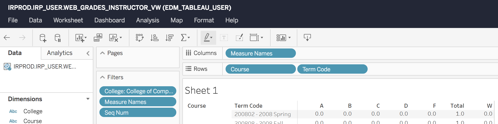

# OMSCentral

  

This project was generated with [Angular CLI](https://github.com/angular/angular-cli) version 1.5.3.

## Development server

Run `ng serve` for a dev server. Navigate to `http://localhost:4200/`. The app will automatically reload if you change any of the source files.

## Code scaffolding

Run `ng generate component component-name` to generate a new component. You can also use `ng generate directive|pipe|service|class|guard|interface|enum|module`.

## Build

Run `ng build` to build the project. The build artifacts will be stored in the `dist/` directory. Use the `-prod` flag for a production build.

## Running unit tests

Run `ng test` to execute the unit tests via [Karma](https://karma-runner.github.io).

## Running end-to-end tests

Run `ng e2e` to execute the end-to-end tests via [Protractor](http://www.protractortest.org/).

## Further help

To get more help on the Angular CLI use `ng help` or go check out the [Angular CLI README](https://github.com/angular/angular-cli/blob/master/README.md).

## Grades Data

For grades data, you can go to `https://tableau.gatech.edu/` and build a worksheet that looks like...

And export a raw csv (not available in the normal views).  Hopefully this method persists...

## Credits
### Contributors

This project exists thanks to all the people who contribute. 

### Backers

Thank you to all our backers! 🙏 [[Become a backer](https://opencollective.com/OMSCentral#backer)]

### Sponsors

Support this project by becoming a sponsor. Your logo will show up here with a link to your website. [[Become a sponsor](https://opencollective.com/OMSCentral#sponsor)]

